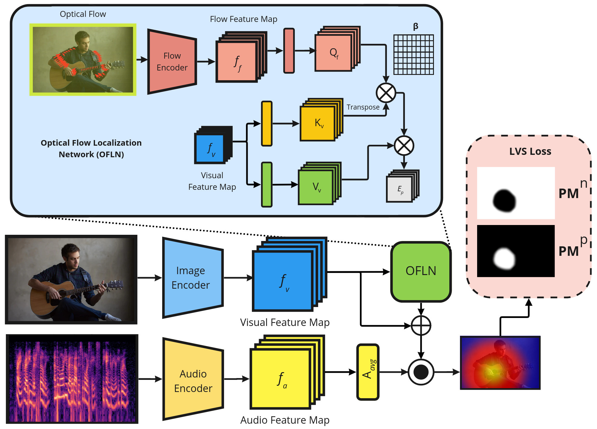

# Hear The Flow: Optical Flow-Based Self-Supervised Visual Sound Source Localization

Official Repository for the 2023 WACV paper: "[Hear The Flow: Optical Flow-Based Self-Supervised Visual Sound Source Localization](https://arxiv.org/abs/2211.03019)"

## Abstract

Learning to localize the sound source in videos without explicit annotations is a novel area of audio-visual research. Existing work in this area focuses on creating attention maps to capture the correlation between the two modalities to localize the source of the sound. In a video, oftentimes, the objects exhibiting movement are the ones generating the sound. In this work, we capture this characteristic by modeling the optical flow in a video as a prior to better aid in localizing the sound source. We further demonstrate that the addition of flow-based attention substantially improves visual sound source localization. Finally, we benchmark our method on standard sound source localization datasets and achieve state-of-the-art performance on the Soundnet Flickr and VGG Sound Source datasets.



## Installing The Environment

Create a virtual environment (Optional) and install necessary packages using:

```
python3 -m venv venv

pip install --upgrade pip

pip install -r requirements.txt --extra-index-url https://download.pytorch.org/whl/cu116

source venv/bin/activate
```

## Dataset Preprocessing

### Flickr SoundNet

Download the Flickr SoundNet data using resources found in [flickr-soundnet-dl](https://github.com/auroracramer/flickr-soundnet-dl).

Download the Flickr SoundNet testing dataset from [Learning to localize sound sources](https://github.com/ardasnck/learning_to_localize_sound_source).

We separate train and test samples by splitting SoundNet's `urls_public.txt` into train and test portions and then download each separately. You can accomplish this by looking at id's present in `metadata/flickr_test_trimmed.csv` and `metadata/flickr_test_expanded.csv`.

    WARNING: Make sure to set infinite duration to download test videos. Not doing so will cause errors in dataset construction

After downloading the Flickr SoundNet data (folder structure should resemble `data/` with `audio/` and `video/` within it), you will most likely be missing a portion of data due to videos being removed or deleted. We provide the exact data we used to train and test, provided in `metadata/`. You may construct your own `.csv` and `.txt` files of the data you have available. 

Once your data is downloaded with new train and test files, run the following preproccessing scripts:

```
python preprocess/preprocess_flickr_train.py

python preprocess/preprocess_flickr_test.py
```


### VGG Sound & VGG Sound Source

These instructions are coming soon!

## Pretrained Models

We release models pretrained on [Flickr SoundNet](https://drive.google.com/file/d/1_ZMsaf65Ikyyjx62JhJ7fab9YmZ7dgwh/view?usp=share_link) and [VGG Sound](https://drive.google.com/file/d/1iL6G0nq9TGRTitQXOjoleIB1xrW7Yxzj/view?usp=share_link). You may freely use these to experiment and test with. 

Once downloaded, place the `.pth` files into `weights/`

## Testing Provided Models

Example script to test on Flickr SoundNet:

```
python test.py --test_data_path <test folder path> --gt_path <path to Annotation folder> --testset <flickr, flickr_expanded> --gpus 1 --ckpt weights/flickr.pth
```

## Training Your Own Model

Example script to train on 10k Flickr samples:

```
python3 train.py --train_data_path <train folder path> --test_data_path <test folder path> --gt_path <path to Annotation folder> --trainset flickr_train_10k --testset flickr --epochs 100 --batch_size 128 --lr 0.001 --flow 1 --gpus 1 --freeze_vision 1 --name "<your experiment name>"
```

## Testing Your Own Model

If you want to test your own model you trained, you can use the `.ckpt` file Pytorch Lightning automatically saves, found in `logs/<experiment name>/best.ckpt`.

## Citation

If you use our code, please cite the following paper:

```
@article{fedorishin2022hear,
  title={Hear The Flow: Optical Flow-Based Self-Supervised Visual Sound Source Localization},
  author={Fedorishin, Dennis and Mohan, Deen Dayal and Jawade, Bhavin and Setlur, Srirangaraj and Govindaraju, Venu},
  journal={arXiv preprint arXiv:2211.03019},
  year={2022}
}
```

## References

Here are related works, codebases we have built off of, and other great resources in this area of research. Please check them out!

* https://github.com/ardasnck/learning_to_localize_sound_source
* https://github.com/hche11/Localizing-Visual-Sounds-the-Hard-Way
* https://github.com/zjsong/SSPL
* https://github.com/stoneMo/EZ-VSL
* https://github.com/stoneMo/SLAVC
* https://github.com/VISION-SJTU/usol/
* https://github.com/heykeetae/Self-Attention-GAN

## Misc. Notes

Due to code/data modifications, the expanded Flickr SoundNet testing set has 1,666 samples instead of 1,769 reported in the paper's supplementary material. This change has little-to-no change in testing results. 